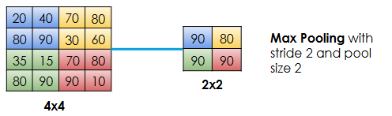
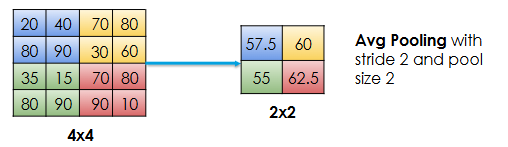

# Pooling

There is one more method that helps in eliminating unwanted information from an image, which is more common, similar, and robust to small changes in the location of features in the input. This method is called Pooling.

There are usually two common mechanisms used in pooling.

## Max Pooling

Max Pooling breaks the convolutional layer output into smaller patches. It is often, for example, a series of 2x2 pixel areas. So it is as if, in this example, there is a 2x2 filter sliding across the image with a stride of 2.

Max Pooling just looks at the values in the patch (window) and selects the maximum value from that patch. So, it helps in feature selection by removing the weak/dim features from a bright foreground and in the process, helps in downsampling or dimensionality reduction.

## Average Pooling

Average Pooling is the same as Max Pooling with one difference - we take the average of the values in the patch (window) instead of the maximum value.

