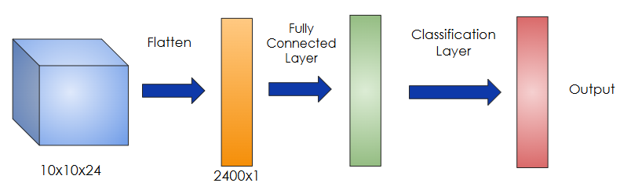
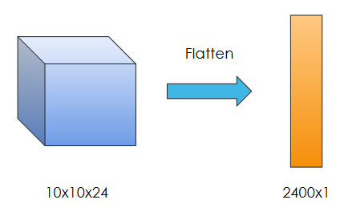

## Flattening an Array

After completing multiple iterations of the convolution and pooling operations on the image, we get feature maps of reduced dimensionality, also having multiple channels. This is a 3D Array of size **(Width, Height, Channels)**. The number of units or values in this 3D array will be Units (U) = W x H x C

Since the output from the Convolution and Pooling operations is a 3D array, we can't directly use them in the fully connected layers of Neural Networks, which only accept 1D arrays of values. This is the main reason we have to flatten the output from Convolutions and Pooling into a 1D array.

Our task here is to flatten this 3D array into a 1D array of size (WxHxC, 1) = (Units, 1)

## Procedure for Flattening a 3D array

- We read row-by-row for each channel starting from the first channel.
- Each row is appended to the 1D flattened array.

For example:

The initial size of the feature map (3D array) after the Convolution and Pooling Operations: 10x10x24

Here we have a height and width of 10 each and 24 channels.

Size after flattening this 3D Matrix: (10x10x24, 1) = (2400, 1)

