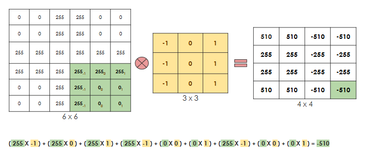
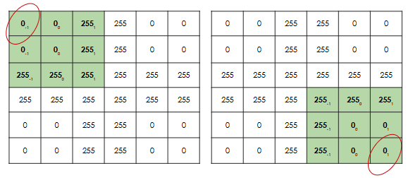
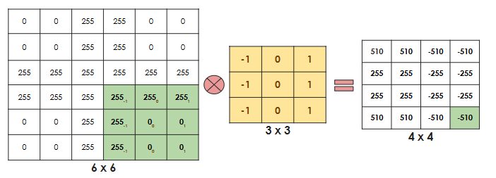
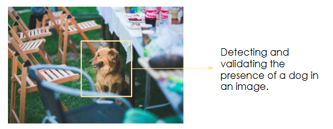
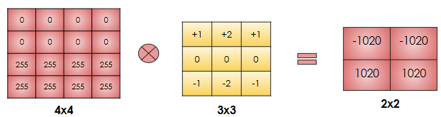
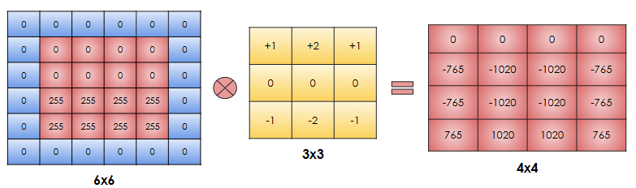
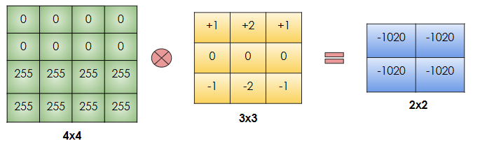
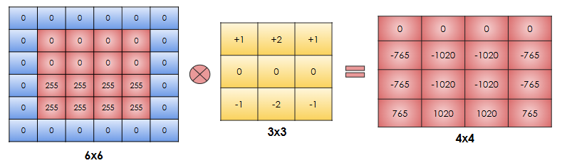
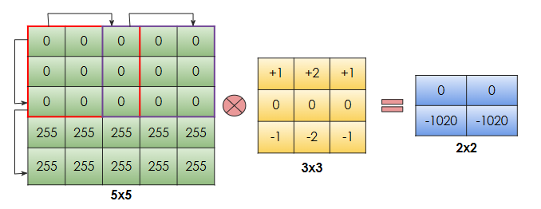

# Recap — The Convolution Operation

Convolution computes each output value as the sum of element-wise products between an input patch and a filter (kernel) as the filter slides across the input.

## Key points

- Convolution uses a sliding filter to produce an output feature map.
- Each output element summarizes a local neighborhood from the input.
- Sliding behavior and kernel size determine how often pixels are used and how the spatial size changes.

---

## Drawbacks of the vanilla convolution

Convolution has three main limitations:

### 1) Under‑utilized edge and corner pixels

Pixels near the image boundaries (especially corners) are covered fewer times by the sliding filter than central pixels. Important features at the edges may therefore be underrepresented.

Example: a crucial object part in a corner (e.g., a duck's head) may be poorly recognized if boundary pixels are rarely used.

### 2) Output spatial size shrinks

A filter of size f×f applied to an n×n input produces an (n−f+1)×(n−f+1) output. Repeated convolutions can rapidly reduce spatial dimensions and make feature extraction more difficult.

This shrinkage may be undesirable when preserving the original spatial resolution matters.

### 3) Sensitivity to exact position

Convolution records precise feature positions. Small translations of an object can change outputs significantly. In tasks that only require presence detection (not exact location), this positional sensitivity is undesirable.

---

## Padding

Padding adds extra pixels (commonly zeros) around the input boundaries to address drawbacks 1 and 2:

- Improves utilization of original edge pixels by moving them away from the border.
- Prevents or controls spatial shrinkage so the output can preserve the input size.

Example: padding a 4×4 input to 6×6 before applying a 3×3 filter yields a 4×4 output (same as the original), avoiding shrinkage.

---

## Types of padding

- Valid padding (no padding): output shrinks; rarely used when preserving size is required.

    Example: 4×4 input → 2×2 output with no padding and a 3×3 filter.

    

- Same padding: pads the input so that the output spatial size matches the input.  
    The common implementation is zero padding (pad with zeros on all edges).

    Example: zero padding converts 4×4 → 6×6 so a 3×3 filter produces a 4×4 output (same as input).

    

---

## Strides

Stride is the step size used when sliding the filter across the input. Larger strides reduce the output spatial resolution and can help make the operation less sensitive to small translations (trading detail for invariance).

